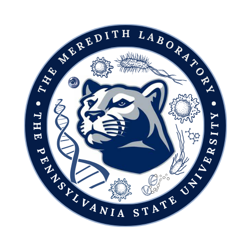

# Brianna L. Watts - Academic Website

<div align="center">

🌐 **[Visit Live Site](https://bri-w12.github.io/CV)**

*A professional academic website showcasing my CV and research updates*

[](https://quarto.org/)
[](https://pages.github.com/)
[](LICENSE)

</div>

---

## 📖 About

This repository contains the source code for my academic website, built with [Quarto](https://quarto.org/) - an open-source scientific and technical publishing system. The site features my complete curriculum vitae and a blog for sharing research updates, conference experiences, and insights from graduate school.

**Graduate Student** | Biochemistry, Microbiology, and Molecular Biology
**Penn State University** | Meredith Lab

---

## ✨ Features

- 📄 **Comprehensive CV**: Education, research experience, publications, presentations, and honors
- 📝 **Research Blog**: Updates about my work on IS1-mediated chromosomal amplification in *E. coli*
- 🎨 **Professional Theme**: Clean, responsive design optimized for academic presentation
- 🔄 **Automated Deployment**: GitHub Actions workflow ensures site updates automatically
- 📱 **Mobile Responsive**: Looks great on all devices
- 🔍 **RSS Feed**: Blog posts available via RSS for easy following
- 🖨️ **PDF Export**: CV can be easily exported to PDF using Quarto

---

## 🛠️ Technology Stack

| Component | Technology |
|-----------|-----------|
| **Framework** | [Quarto 1.4+](https://quarto.org/) |
| **Hosting** | [GitHub Pages](https://pages.github.com/) |
| **CI/CD** | [GitHub Actions](https://github.com/features/actions) |
| **Theme** | Cosmo (Bootstrap-based) |
| **Language** | Markdown / Quarto Markdown (.qmd) |
| **Version Control** | Git + GitHub |

---

## 🚀 Getting Started

### Prerequisites

To work with this site locally, you'll need:

1. **Quarto** - Download from [quarto.org/docs/get-started](https://quarto.org/docs/get-started/)
   - **macOS**: `brew install quarto`
   - **Windows**: Download installer from website
   - **Linux**: `sudo apt install quarto` or download .deb package

2. **Git** (optional, for version control)
   ```bash
   git clone https://github.com/Bri-W12/CV.git
   cd CV
   ```

### Local Development

#### Preview the Site

Start a local development server with live reload:

```bash
quarto preview
```

This will:
- Build the site
- Open it in your default browser
- Automatically refresh when you make changes
- Run at `http://localhost:####` (port number shown in terminal)

#### Render the Site

To build the site without starting a server:

```bash
quarto render
```

Output will be in the `_site/` directory (ignored by git).

#### Check Quarto Installation

Verify your Quarto setup:

```bash
quarto check
```

---

## 📁 Project Structure

```
CV/
├── .github/
│   └── workflows/
│       └── publish.yml          # GitHub Actions deployment workflow
├── posts/                       # Blog posts directory
│   ├── _metadata.yml            # Shared metadata for all posts
│   └── 2026-02-17-creating-website/
│       └── index.qmd            # Individual blog post
├── _quarto.yml                  # Main site configuration
├── index.qmd                    # CV homepage
├── blog.qmd                     # Blog listing page
├── styles.css                   # Custom CSS styling
├── Meredith_lab_logo.png        # Lab logo image
├── .gitignore                   # Git ignore rules
└── README.md                    # This file
```

### Key Configuration Files

#### `_quarto.yml`
Main configuration file that defines:
- Website metadata (title, description)
- Navigation structure (navbar, pages)
- Theme and styling options
- Output formats and directories

#### `index.qmd`
Homepage featuring the complete CV in Quarto Markdown format.

#### `blog.qmd`
Automatically generates a listing of all blog posts from the `posts/` directory, sorted by date.

---

## ✍️ Adding Blog Posts

### Step 1: Create Post Directory

Blog posts follow the naming convention: `YYYY-MM-DD-post-slug/`

```bash
mkdir posts/2026-03-15-my-new-post
cd posts/2026-03-15-my-new-post
```

### Step 2: Create `index.qmd`

Create a file named `index.qmd` with the following structure:

```yaml
---
title: "Your Post Title Here"
author: "Brianna L. Watts"
date: "2026-03-15"
categories: [research, lab-work, conferences]
description: "A brief summary of what this post is about"
image: "thumbnail.jpg"  # Optional: featured image
draft: false            # Set to true to hide from site
---

## Introduction

Your post content starts here. You can use standard Markdown formatting.

### Subheadings

- Bullet points
- Lists
- **Bold** and *italic* text

You can also include:
- Code blocks
- Images
- Links
- Tables
- Citations

## Code Examples

```python
# Quarto supports syntax highlighting
def analyze_data(dataframe):
    return dataframe.describe()
```

## Images


## Conclusion

Wrap up your post here.
```

### Step 3: Preview and Publish

1. **Preview locally:**
   ```bash
   quarto preview
   ```

2. **Commit and push:**
   ```bash
   git add posts/2026-03-15-my-new-post/
   git commit -m "Add new blog post: Your Title"
   git push
   ```

3. **Automatic deployment:** GitHub Actions will build and deploy within 2-3 minutes.

### Supported Content in Posts

- **Markdown**: All standard Markdown syntax
- **LaTeX Math**: Inline `$E = mc^2$` or display `$$\int f(x)dx$$`
- **Code Blocks**: With syntax highlighting for 100+ languages
- **Images**: Local files or external URLs
- **Tables**: Markdown tables or complex HTML tables
- **Callouts**: Note, warning, tip, important boxes
- **Cross-references**: Link between sections and figures
- **Citations**: BibTeX-based citation management

### Post Categories

Suggested categories for organizing posts:
- `research` - Research updates and findings
- `lab-work` - Experimental techniques and protocols
- `conferences` - Conference attendance and presentations
- `publications` - Paper publications and preprints
- `teaching` - Teaching experiences and pedagogy
- `graduate-school` - PhD journey and advice
- `computational` - Bioinformatics and data analysis

---

## 🚢 Deployment

### Automatic Deployment

The site automatically deploys when you push to the `main` branch:

1. **Commit changes:**
   ```bash
   git add .
   git commit -m "Update CV with new publication"
   ```

2. **Push to GitHub:**
   ```bash
   git push
   ```

3. **GitHub Actions runs automatically:**
   - Installs Quarto
   - Renders the entire site
   - Deploys to `gh-pages` branch
   - GitHub Pages serves the updated site

4. **Monitor progress:**
   - Visit: `https://github.com/Bri-W12/CV/actions`
   - Look for green checkmark (success) or red X (failure)
   - Typical build time: 1-3 minutes

### GitHub Configuration

#### Required Settings (One-Time Setup)

**1. Enable Actions Permissions**

Navigate to: `Settings → Actions → General → Workflow permissions`

- ✅ Select "Read and write permissions"
- ✅ Click "Save"

**2. Configure GitHub Pages**

Navigate to: `Settings → Pages`

- **Source**: Deploy from a branch
- **Branch**: `gh-pages` / `/ (root)`
- Click "Save"

**3. Verify Deployment**

After first successful workflow run:
- Site will be available at: `https://bri-w12.github.io/CV`
- May take 5-10 minutes for initial deployment
- Subsequent deploys are faster (1-2 minutes)

---

## 🎨 Customization

### Changing the Theme

Edit `_quarto.yml` and change the theme:

```yaml
format:
  html:
    theme: cosmo  # Try: flatly, simplex, minty, lumen, journal
```

[Browse Quarto themes](https://quarto.org/docs/output-formats/html-themes.html)

### Modifying Styles

Edit `styles.css` to customize appearance:

```css
/* Custom colors */
:root {
  --primary-color: #0066cc;
  --secondary-color: #6c757d;
}

/* Adjust font sizes */
body {
  font-size: 1.1rem;
}

/* Custom heading styles */
h2 {
  color: var(--primary-color);
  border-bottom: 2px solid #dee2e6;
}
```

### Adding New Pages

1. Create a new `.qmd` file (e.g., `publications.qmd`)
2. Add frontmatter:
   ```yaml
   ---
   title: "Publications"
   ---
   ```
3. Update `_quarto.yml` navigation:
   ```yaml
   navbar:
     left:
       - text: "CV"
         href: index.qmd
       - text: "Publications"
         href: publications.qmd
       - text: "Blog"
         href: blog.qmd
   ```

### Adding Images

Place images in the root directory or create an `images/` folder:

```markdown


```

---

## 🔧 Troubleshooting

### Workflow Fails on Push

**Error**: "Unable to publish to GitHub Pages (no gh-pages branch)"

**Solution**: The `gh-pages` branch needs to exist:
```bash
git checkout --orphan gh-pages
git rm -rf .
git commit --allow-empty -m "Initialize gh-pages"
git push origin gh-pages
git checkout main
```

### Site Not Updating

1. Check Actions tab for successful workflow run
2. Wait 2-3 minutes after successful deployment
3. Hard refresh browser: `Ctrl+Shift+R` (Windows/Linux) or `Cmd+Shift+R` (Mac)
4. Check Pages settings point to `gh-pages` branch

### Rendering Errors Locally

```bash
# Clear Quarto cache
quarto clean

# Check Quarto installation
quarto check

# Update Quarto to latest version
# Download from: https://quarto.org/docs/get-started/
```

### Image Not Displaying

- Verify image path is correct and relative to the `.qmd` file
- Check image file extension matches actual file type
- Ensure image is committed to git: `git add image.png`

---

## 📤 Exporting CV to PDF

### Method 1: Using Quarto

```bash
quarto render index.qmd --to pdf
```

Output: `index.pdf`

### Method 2: Print to PDF from Browser

1. Preview site locally: `quarto preview`
2. Open homepage in browser
3. Press `Ctrl+P` (Windows/Linux) or `Cmd+P` (Mac)
4. Select "Save as PDF" as destination
5. Adjust margins and settings as needed

### Method 3: Add PDF Format to Config

Edit `_quarto.yml`:

```yaml
format:
  html:
    theme: cosmo
  pdf:
    documentclass: article
```

Then render: `quarto render index.qmd`

---

## 🔄 Updating Your CV

### Quick Updates

1. **Edit `index.qmd`** with your changes
2. **Commit:**
   ```bash
   git add index.qmd
   git commit -m "Update CV: Add new publication"
   git push
   ```
3. **Wait 2-3 minutes** for automatic deployment

### Best Practices

- ✅ Make frequent, small commits with descriptive messages
- ✅ Preview changes locally before pushing
- ✅ Use semantic version tags for major updates: `git tag v1.2.0`
- ✅ Keep a backup PDF of your CV
- ✅ Update blog when significant CV changes occur

---

## 🤝 Using This Template

Want to create your own academic website using this as a template?

### Fork This Repository

1. Click "Fork" in the top-right of this repository
2. Clone your forked repository
3. Update `_quarto.yml` with your information:
   ```yaml
   website:
     title: "Your Name"
     description: "Your Title"
     navbar:
       right:
         - icon: github
           href: https://github.com/yourusername
         - icon: envelope
           href: mailto:your.email@university.edu
   ```
4. Replace `index.qmd` with your own CV content
5. Delete posts in `posts/` directory
6. Update `README.md`
7. Set up GitHub Pages (see Deployment section)

---

## 📚 Additional Resources

### Quarto Documentation
- [Getting Started](https://quarto.org/docs/get-started/)
- [Creating a Website](https://quarto.org/docs/websites/)
- [Quarto Blog Guide](https://quarto.org/docs/websites/website-blog.html)
- [Markdown Basics](https://quarto.org/docs/authoring/markdown-basics.html)

### Quarto for Academics
- [Academic CV Templates](https://quarto.org/docs/gallery/#cv)
- [Publishing Research Papers](https://quarto.org/docs/journals/)
- [Creating Presentations](https://quarto.org/docs/presentations/)
- [Citation Management](https://quarto.org/docs/authoring/citations.html)

### GitHub Resources
- [GitHub Pages Documentation](https://docs.github.com/en/pages)
- [GitHub Actions for Quarto](https://github.com/quarto-dev/quarto-actions)

---

## 📈 Version History

- **v2.0.0** (2026-02-17) - Converted to Quarto with blog functionality
- **v1.0.0** (2026-02-12) - Initial Jekyll-based site

---

## 📄 License

© 2026 Brianna L. Watts. All rights reserved.

The content of this website (CV, blog posts, images) is proprietary and may not be reproduced without permission. The site structure and configuration files may be used as a template for educational purposes with attribution.

---

## 📧 Contact

**Brianna L. Watts**
PhD Student, Biochemistry, Microbiology, and Molecular Biology
Penn State University

- 📧 Email: [blw5699@psu.edu](mailto:blw5699@psu.edu)
- 🐙 GitHub: [@Bri-W12](https://github.com/Bri-W12)
- 🌐 Website: [bri-w12.github.io/CV](https://bri-w12.github.io/CV)

---

<div align="center">

**Built with ❤️ using [Quarto](https://quarto.org/) and [GitHub Pages](https://pages.github.com/)**

*Last updated: February 2026*

</div>
